# -gabby-cushion-2074

<h1 align="center">oneClickShopping application</h1>

<h2 align="center">project-Logo</h2>

<h2 align="center">A Backend project providing Rest Api for oneClickShopping application. The Api can perform all the crud operation with customer validation on every step.</h2>

 
## Backend Work

 * Proper Exception Handling
 *Proper Input Validation
 * Data Stored in the database(mySQL)
 * User Authentication of signUp and Login

<h2 align="left">Tech-stack</h2>
<h4 align="left">

| Techstack|Purpose |
| ------|------ |
| Spring Boot | Build Java based Spring Application |
| MySQL |Relational Database System |
| Swagger|Simplify API Creation |
| Lombok|Annotation based getter, setter, equals, constructor |

## Installation and Run
* Update the port number, username and password as per our local database config.

-  server.port=8080
- spring.datasource.url=jdbc:mysql://localhost:3306/DatabaseName
- spring.datasource.driver-class-name=com.mysql.cj.jdbc.Driver
- spring.datasource.username=root
- spring.datasource.password=YourPassword
- spring.jpa.hibernate.ddl-auto=update

<h1>Team members:</h1>

 <h2>Project Topic: Online Shopping Application</h2>

<h3>fw19_0275 - Puja Rajesh Deshmukh</h3>
<h3>fw19_0458 - Naman Kumar Singh</h3>
<h3>fw19_0432 - Farheen</h3>
<h3>fw19_0358 - Rajat Kumar Yadav</h3>
<h3>fw19_0512 - Padmanabh Desai</h3>

 

<h1>Modules</h1>
<ul>
<li><h3>Login Module</h3></li>
  <li><h3>Customer Module</h3></li>
  <li><h3>Product Module</h3></li>
  <li><h3>Order Module</h3></li>
  <li><h3>Cart Module</h3></li>
</ul>

<h1>Deployed Video Link</h1>
<ul><li><a target="_blank" href="">Live Project Video Link</a></li></ul>

# Customer Controller

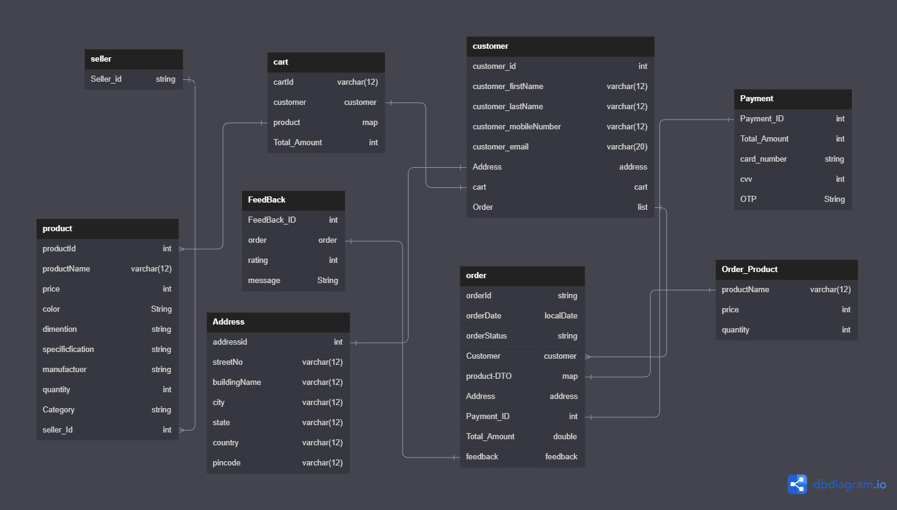

# Customer Controller

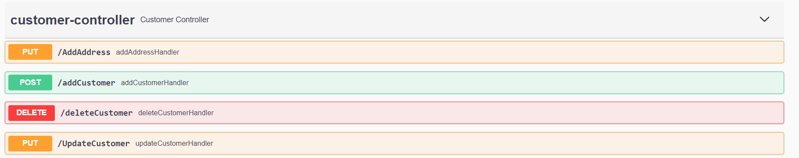

# Admin Controller

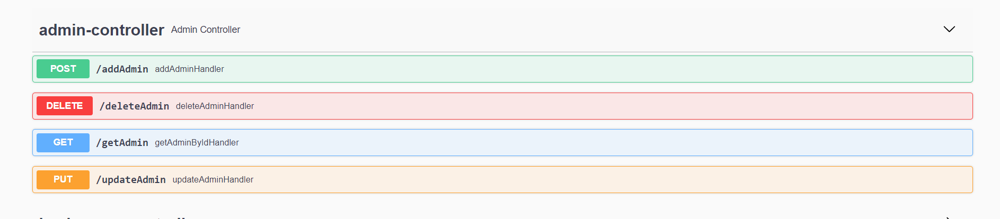

# Seller Controller

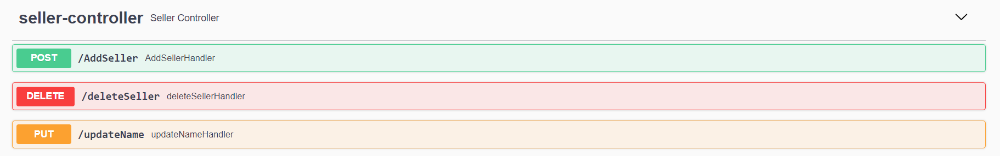

# Product Controller

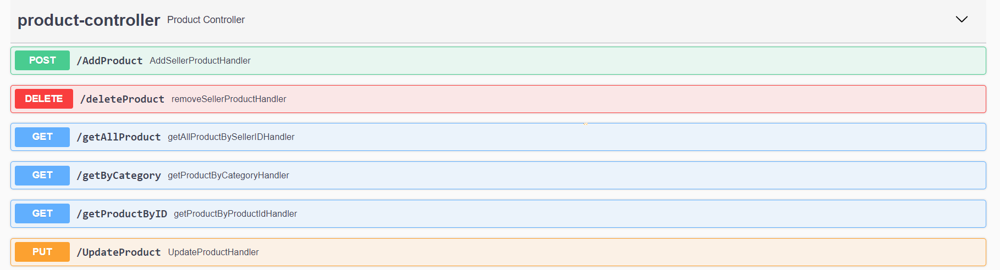

# Cart Controller

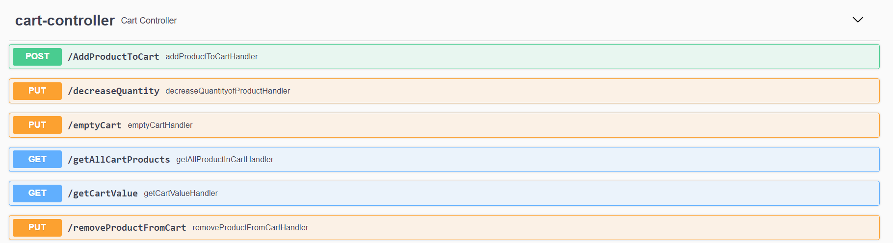

# Order Controller

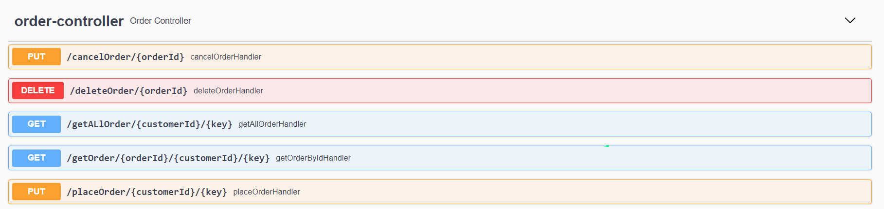

# Payment Controller

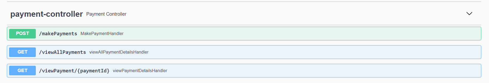

# Feedback Controller

# Sales Controller

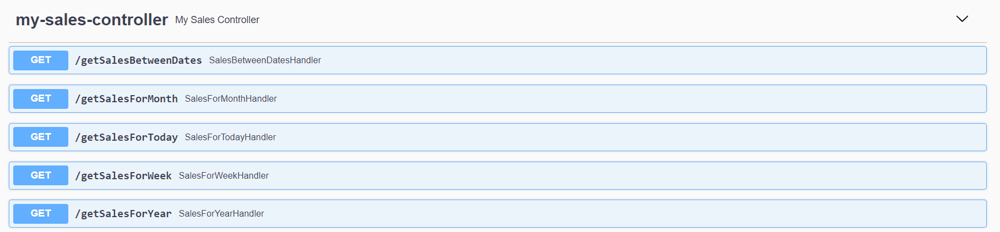

# Card Controller

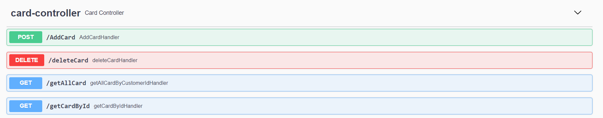

# Login controller

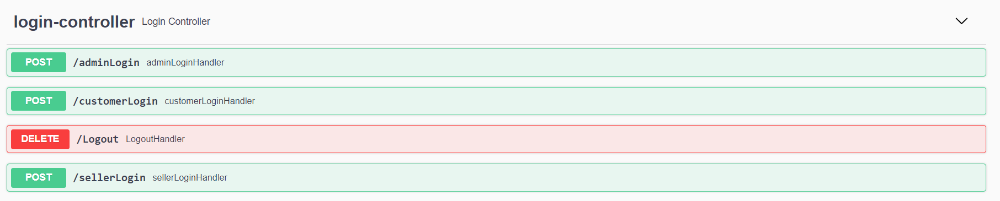
  
  ## Authors

| Contributors|Responsibility |
| ------|------ |
|   |  |

  
 

